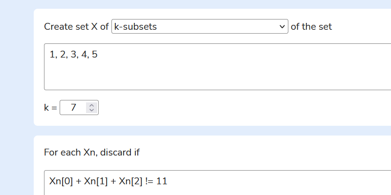

# Exhaustive search calculator

A website for solving simple combinatorics problems using exhaustive searches

## Development

- Clone repository with `git clone https://github.com/jonathanjameswatson/exhaustive-search-calculator.git`
- Install dependencies with `yarn install`
- Run development server on `http://localhost:8080` with `yarn dev`
- Build for production into `dist` with `yarn build`

## Features

- Generating k-subsets, subsets, k-permutations, k-tuples and permutations of the power set
- Filtering tuples using JavaScript predicates
- Removing duplicates from a tuple of tuples

## Website

[Visit the website here](https://jonathanjameswatson.com/exhaustive-search-calculator/)

## Contributing

All pull requests are welcome. Please open issues for any major changes.

## License

[MIT](https://choosealicense.com/licenses/mit/)
